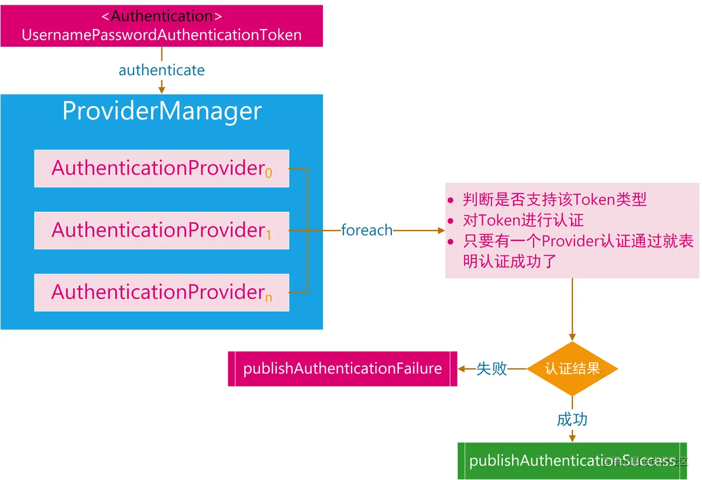
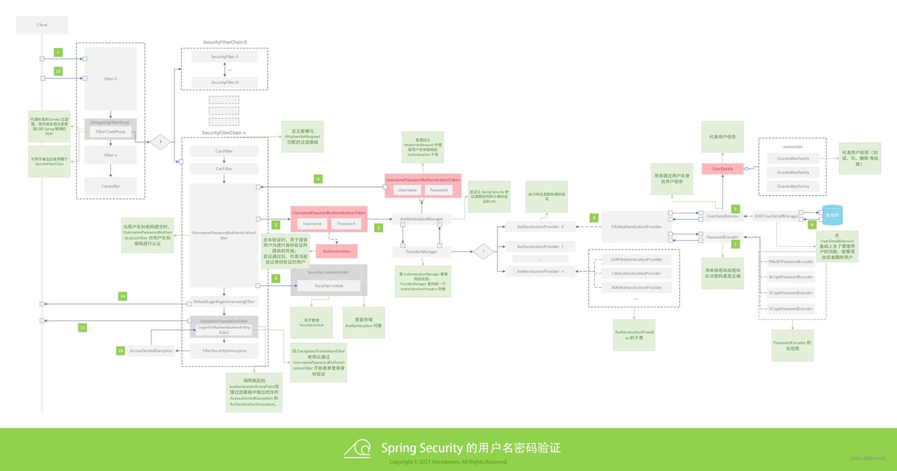

# 环境

# 功能

## 缓冲和缓存

### 点赞

#### 缓存、数据库双写

点赞是高频操作，为了避免每一次点赞都作用于数据库上，我选择将点赞操作先写入redis，再使用定时任务写入mysql
这需要靠AOF保证持久性，避免故障时丢失数据。

RDB的话丢失的数据可能会比较多，但也可以考虑，
因为个人认为，某个用户丢失一两个点赞记录、或者某篇文章少了一两个点赞数，并不算严重，而且不容易被察觉

【缓存、数据库双写，怎么保证数据一致】


#### 冷热缓存

有两个表用来保存点赞数以及点赞关系。
缓存上，这两种记录都分近一小时操作缓存（近期缓存）和一小时前的记录缓存（普通缓存）
在查缓存时，可能需要查三个地方：普通缓存 - 数据库 - 近期缓存
普通缓存查不到时，通过数据库查，然后添加到缓存中

近期缓存可以用于更新数据，点赞记录的更新操作优先作用在近期缓存上，而不是写入数据库。这样可以避免大量数据库操作。同时，近期缓存与普通缓存分离，还可以提升普通缓存的命中率，避免普通缓存因为数据更新而频繁失效。

点赞记录缓存的key：userId:targetType:targetId
value为1或0，表示点赞或者取消点赞

点赞数缓存的key：targetType:targetId
value：点赞数

近期缓存使用Hash结构，方便通过key获取所有field。
而因为Hash结构不能针对field添加过期时间，所以普通缓存使用String结构。

#### 避免刷赞

检查是否已点赞

redis锁 LikeServiceImpl#likeOrUnlike

【redis分布式锁】


#### CAS 更新点赞记录

【CAS操作、redis事务】

#### 追加写

删除时，为了避免使用 where id 导致随机IO，将"删除点赞记录"实现为：插入一行新的数据。其中state字段的值为false，即点赞状态为false，表示已取消点赞

点赞表不使用主键

使用时间戳来区分新旧记录

由于取消点赞是低频操作，所以这个操作带来的优化效果可能不是很明显，但代码实现比较简单，不必区分新增和删除。而且也正是因此，冗余的点赞记录会比较少。

可以考虑建立一个定时任务，定期对数据库表重写，将过时的点赞记录删除，只保留最新的

由于定时持久化都是批量操作，所以自增批量插入效率更高

或者建立两个表，一个是归档表，一个是更新表。新的操作都作用在更新表上，然后定时将最新的数据写入归档表。这样的弊端是查询时需要查两个表，不是很合适

#### 缓存穿透、布隆过滤器

在压测的时候注意到，如果获取点赞数时，目标不存在，那么会频繁请求数据库，造成缓存穿透。所以在获取点赞数时，如果目标不存在，会缓存点赞数为0

而在点赞、以及确认是否已点赞的时候，需要频繁判断目标在不在，所以加了一个布隆过滤器

### 草稿缓存

网上看到的思路：

前端保存"上一次更新时间"，redis缓存文章的key是draft_userId:articleId:updateTime，生存时间为10分钟。
再使用draft_userId:articleId缓存最后的更新时间。
获取最新的草稿时，先获取最后的更新时间，再拼接key获取。而之前的缓存还没过期之前也不会被访问到

### 页面侧栏缓存

每一行都是一个缓存项popular_article，整个侧栏合起来是一个大的缓存项all_popular_articles

当有一个popular_article更新时，移除all_popular_articles

### 页面分层缓存

一个大页面（比如首页）会由多个板块组成，这些板块又由更小的部分组成。

举例：文章页面 - 文章、评论区 - 评论区的一条评论及其回复 - 每一行回复

可以将这些数据进行分层缓存。缓存key的设计是：article_level_index_userId:articleId

level区分不同三层级，index区分同一层的不同行

存json，读json，传json。

当下层数据发生更新时，要删除上层缓存。

当某一块缓存缺失时，需要获取缓存并且拼接json，所以要使用hash缓存页面数据及其key，key可以用于拼接json

article_0_0_userId:articleId page data
article_1_0_userId:articleId article data
article_1_1_userId:articleId comments data
article_2_0_userId:articleId comment:

## SpringSecurity

### 开发接口，允许未登录的用户访问

在可以匿名访问的Controller接口上使用AnonymousAccess注解及对应Get、Post、Put、Delete、Patch的衍生注解，
之后可以通过RequestMappingHandlerMapping获取所有Controller接口，
并通过AnonymousAccess注解获取接口访问路径。
需要注意，接口的访问路径中如果存在路径参数，需要将路径参数占位符替换为通配符`*`

然后在SecurityConfig中，使用`httpSecurity.antMatchers(HttpMethod, urls).permitAll()`设置为不必鉴权的接口

### 基于token的登录和登出

token黑名单

用户退出登录时，token无法立即失效。所以在退出登录时将用户名存入redis中的token黑名单中。
不存储失效的token，因为没必要，直接用username比较就行了
用户重新登录时，将username从黑名单中移除
在jwt filter中检查token时，检查username是否在黑名单中，如果有，则token失效，需要登录

### reflesh token

本质上也是一个token，它可以用来申请一个新的token，但本身并没有特别的功能
通过reflesh token获取新token的接口是开放的

### 验证码功能

参考：
1. https://juejin.cn/post/6854573219936993287
2. https://juejin.cn/post/6967162207935135758

回顾一下 SpringSecurity 的登录处理流程：



SpringSecurity 是通过一个又一个的Filter来实现登录控制和权限控制的
SpringSecurity的Filter入口是DelegatingFilterProxy，
里面的FilterChainProxy包含了SpringSecurity的多个拦截器
登录时用到的拦截器是 UsernamePasswordAuthenticationFilter，
它会从Request域中获取前端传来的username和password
将它包装成一个未鉴权的UsernamepasswordAuthenticationToekn，
然后这个Token再交给ProviderManager来鉴权（ProviderManager的authenticate方法）
默认的登录流程中，ProviderManager会找到DaoAuthticationPrivider，
通过自定义的UserDetailsService查询UserDetails信息，
然后鉴权并给出结果，
最后在UsernamePasswordAuthenticationFilter中调用登录成功或者失败的Handler

我们要自定义登录逻辑，就需要自定义AuthenticationToekn，
在里面加上我们需要的参数（比如验证码），
并从Request中获取参数

因为自定义AuthenticationToekn需要自己初始化，
所以我们要仿照UsernamePasswordAuthenticationFilter，写一个自己的Filter
本系统对应的Filter是LoginAuthenticationFilter
同时还需要自定义用来处理AuthenticationToekn的Provider，
本系统对应的Provider是UsernamePasswordCaptchaAuthProvider。

不同的登录方式需要有不同的AuthenticationToekn和Provider，
这可以灵活拓展。
SpringSecurity这里采用了责任链和模板方法模式，已经能够很方便我们拓展了。
就是很多框架自己实现的类我们都用不上，要自己重写，上手没那么简单

还有一个很坑的地方。记得写登录成功或者失败的Handler回调！！否则可能会有奇奇怪怪的bug。
比如我遇到的：我的登录url是"/users/login"，
但我在用户登录成功之后，访问不到对应的Controller，
直接提示我404 Not Found，并说我的请求路径是"/"
原因就是我没有写登录成功的Handler。但具体怎么变成404的，我也不理解

##Web

### 全局异常处理器


### 全局返回值处理器

### 获取当前登录用户的参数解析器

### 路径参数检查的拦截器

## 持久层

### MyBatis自定义类型处理器 TypeHandler

可以用于将 集合 自动转为 JSON 格式存在数据库中

见 JsonSetTypeHandler

## 消息通知

### 消息通用要素

1. 是否已读
2. 消息模板
3. 消息其他属性（json）

### 添加好友

要素：
1. 申请人
2. 申请对象
3. 申请信息
4. 是否通过

### 点赞

要素
1. 点赞用户
2. 点赞目标id
3. 点赞目标类型（哪个表的id）
4. 附加属性（比如，点赞的文章的url以及文章标题）

### 评论

要素
1. 评论用户
2. 评论内容
3. 评论目标id
4. 评论目标类型
5. 附加属性（比如，评论的文章的url以及文章标题）

### 关注

要素
1. 关注用户
2. 附加属性（从哪里关注的）

### 私信

要素
1. 发送者
2. 接收者
3. 内容


# 踩坑

## docker的使用

```shell
docker-compose -f docker-compose-app.yaml up
```

## 多模块打包

参考连接1

参考连接2

参考连接3

只需要对启动类模块打包。在启动类模块下使用mvn package

其他模块的pom插件：
```xml
        <build>
            <plugins>
                <plugin>
                    <groupId>org.apache.maven.plugins</groupId>
                    <artifactId>maven-compiler-plugin</artifactId>
                </plugin>
            </plugins>
        </build>
```
启动类模块的：
```xml
        <build>
            <plugins>
                <plugin>
                    <groupId>org.springframework.boot</groupId>
                    <artifactId>spring-boot-maven-plugin</artifactId>
                    <executions>
                        <execution>
                            <id>repackage</id>
                            <goals>
                                <goal>repackage</goal>
                            </goals>
                        </execution>
                    </executions>
                    <configuration>
                        <mainClass>
                            ${start-class}
                        </mainClass>
                    </configuration>
                </plugin>
                <plugin>
                    <groupId>org.apache.maven.plugins</groupId>
                    <artifactId>maven-compiler-plugin</artifactId>
                    <version>3.1</version>
                    <configuration>
                        <source>${java.version}</source>
                        <target>${java.version}</target>
                        <encoding>${project.build.sourceEncoding}</encoding>
                        <buildDirectory>${project.build.directory}</buildDirectory>
                    </configuration>
                </plugin>
            </plugins>
        </build>
```
### 服务器mysql访问权限

问题：项目运行时访问数据库，出现：java.net.ConnectException: Connection refused (Connection refused)

尝试通过idea链接远程数据库，报错：Host is not allowed to connect to this MySQL server

参考链接1

注意：mysql 8 以后不允许在 GRANT 命令后设置密码
```shell
    update sysUser set host='%' where sysUser='nowander_user';
    alter sysUser nowander_user identified with mysql_native_password by 'baotamysql123456'; # 明文加密方式
    Grant all privileges on nowander.* to 'nowander_user'@'%';
    Grant all privileges on nowander.* to 'nowander_user'@'%'; # 执行两次
```

### 更新项目

1.  maven 项目clean - install
2.  对启动类所在的包进行clean - install （也许可以省略这一步）
3.  将jar发到服务器
4.  通过Dockerfile构建新镜像
    docker build -f 文件路径 -t 镜像名 . # 文件名为Dockerfile时可省略，最后的.不要忽略
5.  通过docker-compose创建并运行容器


##测试

### 多模块测试
```java
    @SpringBootTest(webEnvironment = SpringBootTest.WebEnvironment.RANDOM_PORT, classes = com.nowander.starter.NowanderApplication.class)
    @ComponentScan(basePackages = "com.nowander.forum.mapper")
```
Websocket测试

引入websocket 后使用junit测试保存 javax.websocket.server.ServerContainer not available
在测试类上面加上注解
```java
    @SpringBootTest(webEnvironment = SpringBootTest.WebEnvironment.RANDOM_PORT)
```